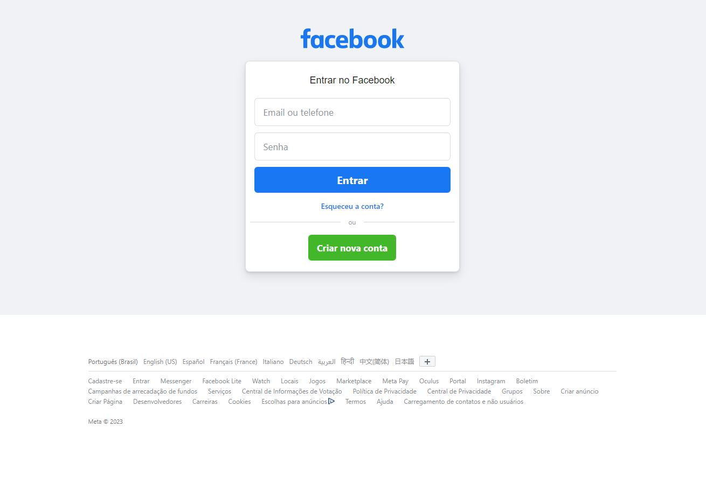
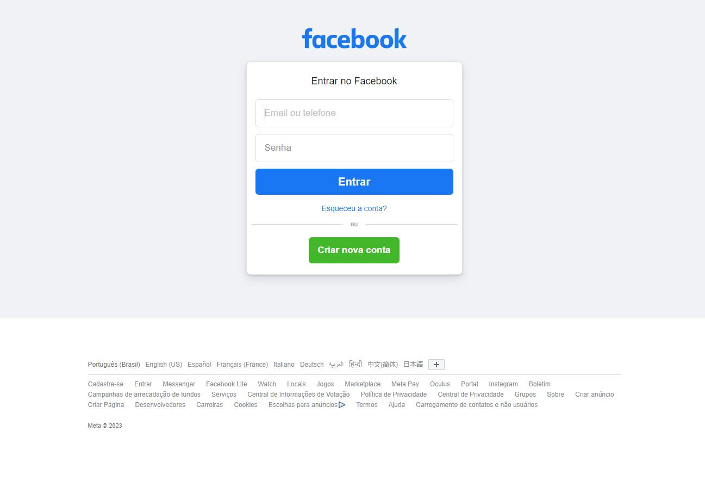
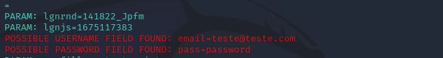

# Phishing para captura de senhas (Ex: Facebook)

### Ferramentas

- Kali Linux
- setoolkit

### Configurando o Phishing no Kali Linux

- Necessário acesso como root: ``` sudo su ```
- Iniciando o setoolkit: ``` setoolkit ```
- Tipo de ataque: ``` Social-Engineering Attacks ```
- Vetor de ataque: ``` Web Site Attack Vectors ```
- Método de ataque: ```Credential Harvester Attack Method ```
- Método de ataque: ``` Site Cloner ```
- Obtendo o endereço da máquina: ``` ifconfig ```
- URL para clone: https://www.facebook.com/


    Após realizar os passos acima a URL escolhida será clonada, e o IP da máquina Kali funcionará como um
    servidor na rede monitorando todo tráfego acessado através do IP que neste caso irá apresentar na tela a página
    clonada do Facebook (neste estudo a url do facebook clonado é apresentada como o ip da máquina kali, porém em
    um phishing real ele é mascarado como uma url legitima para se parecer com a real. 


    Ao acessar o link e colocar as informações de login, essas informações são transmitidas ao invasor e o site
    redirecionado à página original, neste caso o facebook. Como em muitos casos a pessoa já se encontra logada em
    sua conta na página original, quando redirecionado a pessoa nem percebe que acaba de cair em um golpe de
    phishing.


### Resutados

- Página de login clonada do Facebook


- Página de login real do Facebook


- Resultado final do phishing
